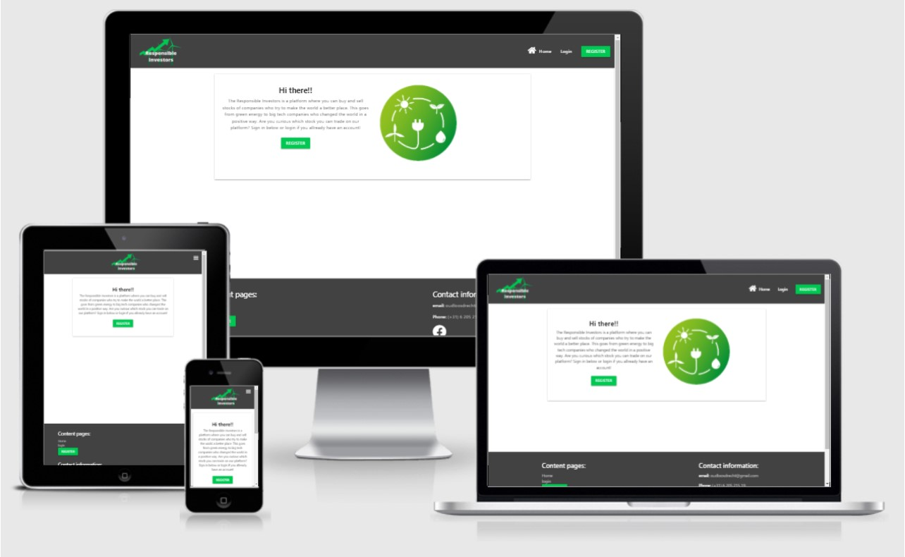
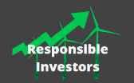
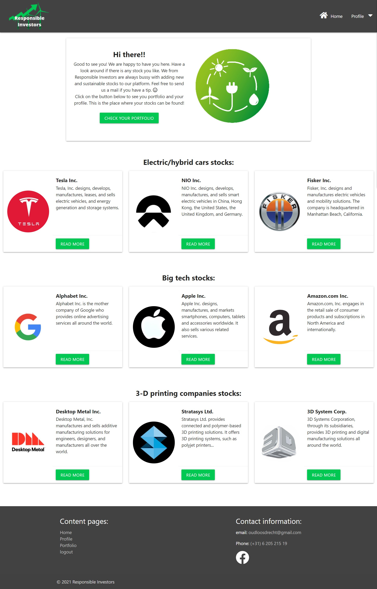
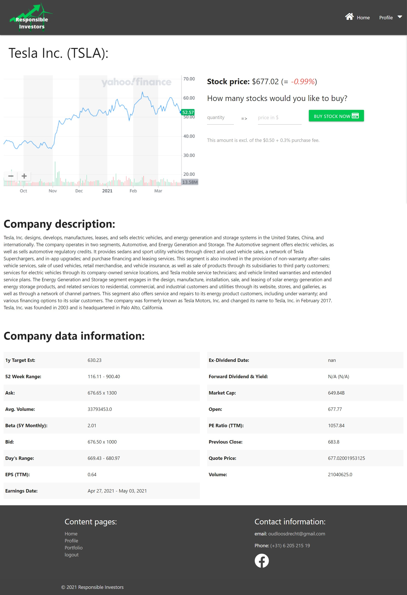
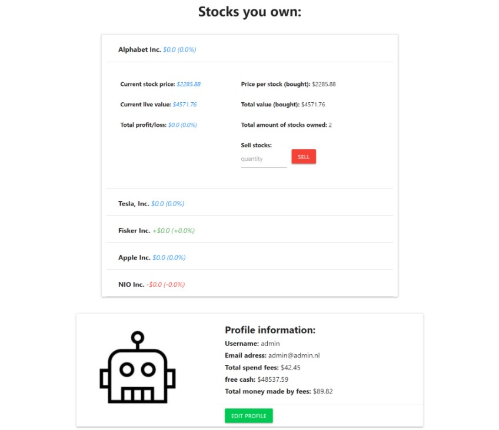
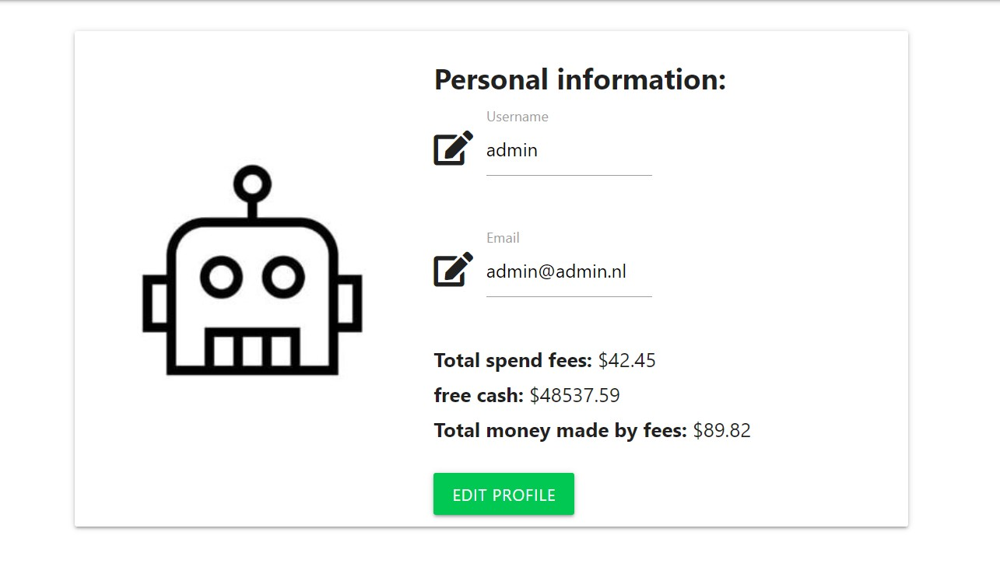
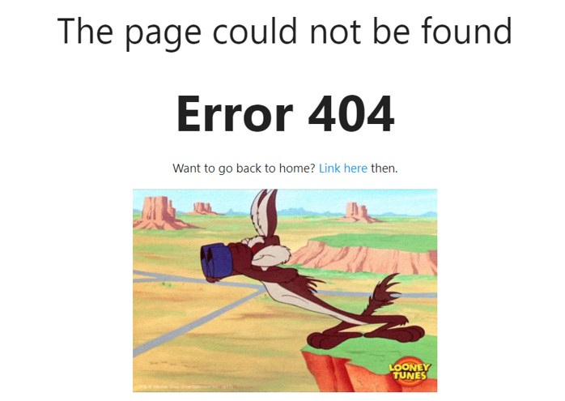

## Table of Contents

-   **[Description](#description)**
-   **[Deployment and Live Demo](#deployment-and-live-demo)**
    -   [Download](#download)
    -   [Clone with Git](#clone-with-git)
    -   [Live Demo](#live-demo)
-   **[UX](#ux)**
    -   [User Stories](#user-stories)
    -   [Wireframes](#wireframes)
    -   [Design](#design)
-   **[Features](#features)**
    -   [Different pages](#different-pages)
    -   [buy a stock function](#buy-a-stock-function)
    -   [sell function and portfolio](#sell-function-and-portfolio)
    -   [profile updating](#profile-updating)
    -   [Login and register page](#Login-and-register-page)
-   **[Technologies](#technologies)**
-   **[Tools](#tools)**
-   **[Testing](#testing)**
    -   [Manual Testing](#manual-testing)
    -   [User Testing](#user-testing)
-   **[Upcoming Features](#upcoming-features)**
-   **[Acknowledgments](#acknowledgments)**

---

## Description

"Responsible Investors is a online broker platform where people can make an account and buy and trade in responsible stocks. The 9 stocks selected for the site are mostly companies who are working on making our planet a better place. Every user gets $10000 (fake) dollars to trade with. Every user pays a small fee ($0.50 + 0,3%) for every trade they make, with this money we from Responsible Investors can keep updating our platform" 

---

## Deployment and Live Demo

The game can be used locally by cloning or downloading the repository from [github](https://github.com/waterrot/responsible-investors).

### Download

1. Click on "Clone or download" under the repository name.

2. Click on "Download ZIP"

3. Choose directory to download it to and unzip file

4. Access the Responsible-Investors-master folder

5. Open index.html into your browser to open the Responsible Investors website

### Clone with Git

In your local IDE:

1. Open a new terminal window

2. Change the current working directory to the location where the cloned directory to be created.

3. Enter the following line in the console:

    `git clone https://github.com/waterrot/responsible-investors`

4. Press enter

### Live Demo

The live demo of the website has been deployed to Heroku and is accessible [here](http://responsible-investors.herokuapp.com/).

---

## UX

### User Stories

_Generic User / Player_

-   I want to make an account on the Responsible Investors website.
-   I want to login on the Responsible Investors website.
-   I want to logout of the Responsible Investors website.
-   I want to change my email adress and/or username.
-   I want to read more information about a curtain stock.
-   I want to see which stocks I can buy on the website
-   I want to buy a stock that I like.
-   I want to see how much I gained/lossed on my stock purchase.
-   I want to see how much I spend on trading fees.
-   I want to sell one of my stocks

These goals are accomplished in the following way:

-   A new user can click on the register button on the home screen to make a new account.
-   An existing user can click on the login link to log into the website.
-   An existing user can click on the logout button when he/she is logged in and would like to logout.
-   An existing user can go to profile to change their username/emailadres.
-   An existing user has to login and then can go to the home page to compare the different stocks provided by website.
-   An existing user can click on the stock he/she would like to buy and then fill in the amount of stock he/she wants to buy.
-   An existing user who allready has bought a stock can go to the portfolio to see how their stock is performing.
-   An existing user who allready has bought a stock can see how much he/she has spend on fees on the portfolio page and the profile page.
-   An existing user who allready has bought a stock can sell their stock on the portfolio page by filling in the amount he/she would like to sell and then click the sell button.
-   In the footer of the site the email addresse of the creator is visible so people can get in touch.

### Wireframes

The wireframe was made by hand. The final version of the wireframes can be found [here](static/images/readme/wireframe.jpeg)

### Design
When the website was made it had a focus on mobile and on desktop vieuw. down below you can find 2 of main design challenges: 

#### colors
The green color (#00c853) was choosen from the standaard colors of Materialize. For a broker the color green and red are important, 
these 2 colors are associated with 'win/loss' and influences to users unconsciously. For the red color we choose #F44336, this color 
 was also chosen with the help of Materialize.

#### Logo
The logo was made with help of [Canva](https://canva.com). I used windmills and an arrow who points upwords. I choose for this because the image 
of the website is green/responsible investing and a combination of gaining money (what the arrow symbolizes) and the windmill, who stands for a green world,
seems like a good combination for that.

---

## Features

### different Pages

The website has 8 main (template) pages the user can use. These are the most important ones for the use of the website:

-   **Home page** This section is a card designed section where people can read the introduction to the site (diffent text and call to action for logged in/logged out) and when logged in the user can see the diffent stocks they can choose from. In these card is also a button so they can go to that stock page.
    
-   **Stock page** On this page users can read more information about the stock. They can see a graph (just a photo), read a description about the company, read technicall infromation about the stock and buy the stock. every stock has his own page, so there are 9 of these pages.
    
-   **Portfolio page** Here users who are logged in can see their stock and how they are performing. Next to seeing how they are performing users can also sell their stocks on this page. And below the portfolio users can see there account datails and can click on it to edit there information.
    
-   **Profile page** On this page users can see their personal information and can also change it here. And the admin user can also see how much the website has made for the company, more about this will follow later in this document.
    
-   **error 404 page** When people come on a page on the site that is not existing they will come at the error 404 page. On this page the user can see that they have an error 404 and get a link to go back to the homepage. On this page there is also a GIF of a cartoon searching for something. This has been added give a smile on the face of a frustrated user who is not finding the page he/she is looking for. Down below you can see this page but it is better to see the live version of it because of the moving GIF.
    
-   **The other pages** The other pages are the error 500 page, login and register. These pages will be discussed at the functions part here below.

### buy a stock function

On the stock page users can buy a stock. They have to fill in the amount of stocks they want to buy and then and press the buy button. When the user changes the amount of stocks
the total price will change on the display. When the stock is bought the the total price of the stocks will be deducted from their free cash available (everyone gets a 10k when signing up). 
For this reason a user can never buy more stocks then free cash he/she has. And the stock will be pushed to the database and will be shown on the portfolio page. There is also a small fee for 
buy a stock, for every purchase a user pays $0.50 + 0,3% to the website. The total amount of money for every user can be seen on the profile and portfolio page. On the photo below you can 
see the stock page of tesla with the buy function in it.

### sell function and portfolio 

On the portfolio page the user can sell their stocks. They can type in the amount of stocks they want to sell (with the max of their own stocks owned). The sell price will be
added back to the free cash available so that the user can buy new stock if he or she prefers that. In the same section as the sell function the user can also see how their stock 
is performing. they can see: current stock price, the avg bought price, total value position, total bought price position, profit/loss in $ and % and the total stocks owned. 
Down below you can see a picture of the portfolio with all the information and the sell function.

### profile updating

On the profile page it is possible to change the emailadres and the username. Next changing the email and username the user can see the free cash available, 
total money spend on fees and for the admin user it is also possible to see how much money the website has made in fees. All the fees paid by users will add 
up and be show here to the admin. Down below it is posible to see how this looks like. If anybody would like to see how this looks like in the life website 
they can send a email to oudloosdrecht@gmail.com. For security reasons I can not upload the login of the admin in the readme file. 

### Login and register page

On the register page new users can create an account. They have to fill in a username, their emailadress and a password. This data first will be validated with 
some valide function in the python code and then will be checked if it is not allready existing in the database. If the data passed all the test the user will 
be created and the users can see more content on the site. All these data will be stored in the database, but the password will not be visible in the database. 
the password has been protected with Werkzeug, so even the owner of the database can not see the password. The user can also logout and later login using the 
login fuction. This function only requires the user to fill in their emailadres and their password. 

---

## Technologies

-   HTML
-   CSS
-   JavaScript
-   Python
-   regex
-   [MongoDB](https://mongodb.com)
-   [JQuery](https://jquery.com/)
-   [Materialize](https://materializecss.com/)
---

## Tools

-   Pen and paper to create the wireframe
-   [Canva](https://canva.com) to create the logo
-   [Font Awesome](https://fontawesome.com/): used for all icons throughout the site
-   [ResponsiveDesign.is](http://ami.responsivedesign.is/): used to make a photo of how the website will look in different screen sizes.
-   [yahoofinancials](https://pypi.org/project/yahoofinancials/): I used this API (togetter with the [yfinance](https://pypi.org/project/yfinance/), while I needed both to fullfill my wishes)to get the data from the stocks so that it could been shown on the site.
---

## Testing

### Manual Testing

When the user want to register for the website he/she can go to the register page, by clicking on the register button in the navbar, and fill in their email, 
username and password. When they have done that they created an account and can see more content on the site.

When the user want to logout of the site they can press the logout button in the navbar.

When the user want to login he/she can go to to the login page, by clicking on the link in the navbar, and fill in their emailadress and their password. 
When they push the login button they are logged in again on the website.

When the user get the home page he/she can read the first card that comes on the screen. The text that is shown to the user is an intro to website.
When the user is logged in the CTA button will be go to the portfolio page and when the user is not logged in the CTA will be to register. 

When the user is logged in and on the home page he/she can see all the stocks available to buy. The will see a card element with the stock title, 
short stock description and a button to read more about the stock and buy it.

When the user is on the page of a stock they can read more information about the stock and buy the stock by filling in the amount he/she wants to buy and then 
press the buy button.

When the user wants to see their open options they can go to the portfolio page by clicking on it on the link in the navbar. When they are on the page he/she can 
see all the information about the stock.

When to user wants to sell the stock he/she has to go to the portfolio page and then click on the stock they want to sell. Then fill in the amount of stocks he/she 
wants to sell and then press the sell button.

When the user wants to change their emailadres or their username they can go to the profile page by clicking on the link in the navbar. On this page the can fill in 
the data they want to change and then press the change button to change that information.

### User Testing

The website is fully working and users with no technical knowage can easily test it. I asked 3 friends if anything was unclear to them when they used the site.
This resulted in the following changes:

-   Fixed a valider function in python, the one for the password was not working correctly.
-   Added a variable to the profile of the user so they can also see the total amount of money spend on fees.
-   Changed the portfolio page, it first was a long horizontal list with information. But this was not very mobile friendly.

## Upcoming features

A number of new features will be implemented in the future.

-   Adding stocks from diffent currencies and calculate them back to the us dollar so a user can by the stock. 

-   When the market is closed make sure the users cannot trade anymore. In the real world people this is also the case. But to make testing around the platform easier this function has been deleted from the website.

-   Adding more stocks, right now there are only 9 stocks available, it would be better to have more stocks available in the future.

-   Adding a search function to the site to look for stocks.

---

## Acknowledgments

Thanks to [Felipe Alarcon](https://github.com/felipe-alarcon) for helping me with brainstorming on how to code curtain things and for helping me reflect on my own work.

[My old Code Institute MSP2 project](https://github.com/waterrot/Ultimate-Piccolo-The-Game) helped me in to create this readme file, I used that as a template.

Thanks [Slack Overflow](https://stackoverflow.com/) for giving me code idea's when I was not curtain on how to code something.

Thanks [Materialize](https://materializecss.com/) for providing basic code to make the basic elements on the side like the footer and header.

Thanks to [Ask python](https://www.askpython.com/python-modules/flask/flask-error-handling) for helping me with making the functions for the 404 error and the 500 error.

Thanks to [Luke Garnham](https://github.com/LukeGarnham/Wired-and-Wiser-MS3), I just his valider code as an inspiration for my own code.